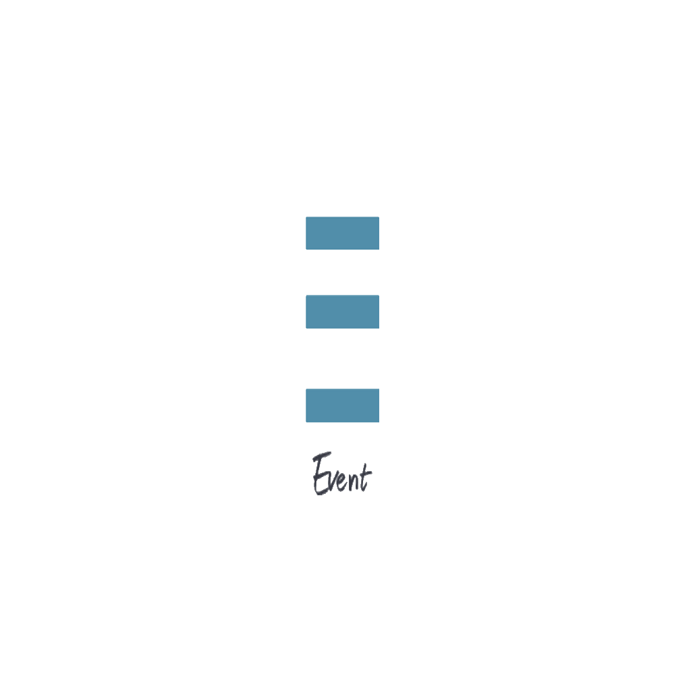

    
    <h1 align="center"> Events </h1>

    An application for creating, organizing events and participating in events.

    
    
    
    

    This repository consists of a <strong>React Native Events Application</strong> built with <strong>Expo CLI</strong> and <strong>Server</Strong> build with <strong>NodeJs</strong> and <strong>MongoDB</strong>.

    Meetings helps organizations and users to keep track of events. <strong>Create</strong> and <strong>Participate</strong>!

## Application features

* `10 Screens` - Home, Register, Login, ParticipantAccount, OrganizationAccount, Event Listings, Event Details, Event Edit, OrganizationEvents, Origanization List Screens.

* `Animation` - Using Lottie (Activity Indicator, done animation and more).

* `Authentication` - User authentication (Register, Login/out) using `Jwt`.

* `Verification` - Send verification email to verify user email using `nodemailer `

* `Real time application` - Send and receive data using `Socket.io`

* `Cache Layer` - Caching Images.

* `Custom and Reusable Hooks` - Api, Auth.

* `Form Validation` - Using `Formik` and `Yup`.

* `Gesture Handler` - Swipe to delete, and pull to refresh.

* `Navigation` - Using React Navigation and Stack Navigator.

* `Reusable Components` - Button, Icon, Forms, Screen, Text, Text Input and more.

* `Splash Screen` - Logo Screen Design while the app is launching.
